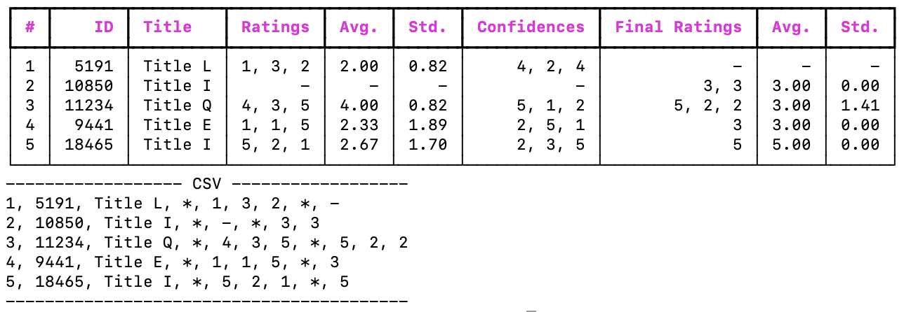

This repo automates the process of logging into OpenReview, gathering submission info, and printing it in a format that you can copy-paste into your tracker spreadsheet.

This repo will render a summary of the papers in your AC batch:


## Prerequisites

* Python 3.10.0 or later ( verified to work with 3.10.0 )
* [Firefox browser](https://www.mozilla.org/en-US/firefox/download) ( other browsers may work, but are untested and would require changes to the code )
* geckodriver
    * Install geckodriver using your package manager, or download it from [here](https://github.com/mozilla/geckodriver/releases)
        - Or if you would preffer to use a package manager
        ```bash
        # Linux
        sudo apt install firefox-geckodriver # Debian/Ubuntu
        sudo dnf install firefox-geckodriver # Fedora/RHEL/CentOS
        sudo pacman -S firefox-geckodriver # Arch Linux
        nix-env -iA nixpkgs.firefox-geckodriver # NixOS

        # For MacOS
        brew install geckodriver

        # For Windows, download the geckodriver executable and add it to your PATH

        ```
## Usage

### Step 0

Create a virtualenv, install dependencies.

```bash
python3 -m venv .venv
source .venv/bin/activate # On Windows, use .venv\Scripts\activate
pip install -r requirements.txt
```

### Step 1

Enter your OpenReview credentials in the .env file.

```bash
# Create a .env file in the root directory of the repo
echo "USERNAME=<YOUR-USERNAME>" > .env
echo "PASSWORD=<YOUR-PASSWORD>" >> .env
```

### Step 2
Edit the `conf.yaml` file to specify which conference you want to scrape, and how to capture the data.


### Step 3
Run the script to log into your account, gather submission info, and print it.

To find all the conferences that are configured, run:

```bash
>> python3 src/run.py --list-conferences
```

Then Run the script with the conference name you want to scrape:

```bash

>> python3 src/run.py --conference <CONFERENCE-NAME>
```

You can also run the script with the `--headless` flag to run it in headless mode (no browser window will be opened):

```bash
>> python3 src/run.py --conference <CONFERENCE-NAME> --headless
```
